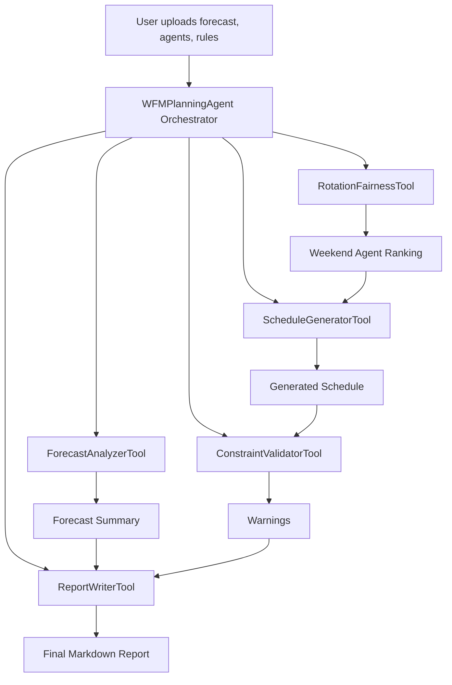

# Architecture

## Agentic Design

WFM Planning Agent uses a local orchestrator with specialized tools. It does not call an external LLM. The agentic behavior comes from sequencing tools, storing intermediate state, making rule-based decisions, validating the result, and producing an explainable reasoning trace.

## Orchestrator

`WFMPlanningAgent` is the central controller. It loads inputs, validates schemas, calls each tool in order, records reasoning messages, and returns one structured result object.

## Tool Flow

1. `ForecastAnalyzerTool` calculates interval gaps and labels each interval as understaffed, balanced, or overstaffed.
2. `RotationFairnessTool` ranks weekend candidates using availability, recent weekend work, and start-time preference.
3. `ScheduleGeneratorTool` generates allowed shifts while avoiding vacation assignments.
4. `ConstraintValidatorTool` checks guardrails and warns about coverage and fairness risks.
5. `ReportWriterTool` converts computed outputs into a business-friendly Markdown report.

## State and Reasoning

The agent keeps a `reasoning_log` list. Each step adds a short explanation of what was loaded, which tool was called, and what the tool found. This gives the demo an auditable trace without exposing private chain-of-thought or relying on hidden services.

## Why Deterministic Local Tools

The Kaggle capstone rewards useful agentic systems. For this business planning use case, local deterministic tools are appropriate because scheduling decisions need to be repeatable, inspectable, and safe from accidental API cost. The design still demonstrates tool use, orchestration, validation, and reporting.

## Diagram

